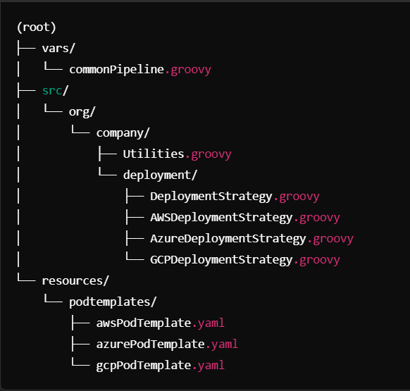
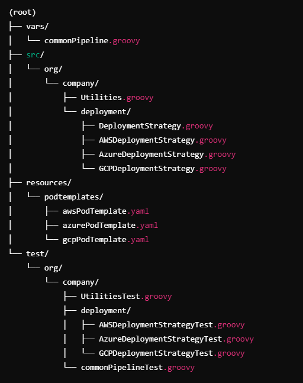

# Arquitectura DevOps Multinube con Pod Templates Personalizados para AWS, Azure y GCP

## Introducción

En un entorno de desarrollo moderno, es fundamental contar con una arquitectura de CI/CD que sea flexible, escalable y capaz de adaptarse a múltiples proveedores de nube como **AWS**, **Azure** y **GCP**. Esta guía presenta una arquitectura que integra **Jenkins**, **Kubernetes** y librerías compartidas de **Groovy** para gestionar despliegues multinube de manera eficiente.

### El objetivo es:

- **Modularidad**: Separar la lógica y configuraciones específicas de cada proveedor de nube.
- **Flexibilidad**: Permitir despliegues en diferentes nubes cambiando solo parámetros en el pipeline.
- **Escalabilidad**: Facilitar la adición de nuevos proveedores de nube en el futuro.
- **Mantenibilidad**: Centralizar y organizar el código para un mantenimiento más sencillo.

## Visión General de la Arquitectura

1. **Patrón Estrategia para Despliegues Multinube**:  
   Utilizamos clases específicas para manejar la lógica de despliegue en **AWS**, **Azure** y **GCP**.

2. **Pod Templates Personalizados por Proveedor de Nube**:  
   Los pod templates en **Kubernetes** se ajustan según el proveedor de nube, incluyendo las herramientas y configuraciones necesarias.

3. **Parametrización Dinámica de Pod Templates**:  
   El método `generatePodTemplate` en la librería compartida selecciona y personaliza el pod template adecuado en función del proveedor de nube.

4. **Pipeline Unificado y Modular**:  
   El pipeline utiliza la misma estructura para todos los proveedores, parametrizado según las necesidades del proyecto y del entorno.



## 2. Pod Templates Personalizados
**awsPodTemplate.yaml**

```yaml
kind: Pod
metadata:
  labels:
    app: ${appLabel}
spec:
  containers:
    - name: ${containerName}
      image: openjdk:${javaVersion}-jdk
      command:
        - cat
      tty: true
    - name: awscli
      image: amazon/aws-cli
      command:
        - cat
      tty: true
```

## 3. Librería Compartida en vars/
commonPipeline.groovy
```groovy
import groovy.text.SimpleTemplateEngine
import org.company.Utilities

def call(Map config) {
    pipeline {
        agent {
            kubernetes {
                label config.label
                defaultContainer config.defaultContainer
                yaml generatePodTemplate(config)
            }
        }
        stages {
            stage('Checkout') {
                steps {
                    script {
                        def utils = new Utilities(this)
                        utils.checkoutCode(config.repoUrl)
                    }
                }
            }
            stage('Build') {
                steps {
                    script {
                        def utils = new Utilities(this)
                        if (config.language == 'java') {
                            utils.buildJavaProject()
                        } else if (config.language == 'node') {
                            utils.buildNodeProject()
                        }
                    }
                }
            }
            stage('Deploy') {
                steps {
                    script {
                        def utils = new Utilities(this)
                        utils.deploy(config.cloudProvider)
                    }
                }
            }
        }
    }
}

def generatePodTemplate(Map config) {
    String podTemplateFile
    if (config.cloudProvider == 'aws') {
        podTemplateFile = 'awsPodTemplate.yaml'
    } else if (config.cloudProvider == 'azure') {
        podTemplateFile = 'azurePodTemplate.yaml'
    } else if (config.cloudProvider == 'gcp') {
        podTemplateFile = 'gcpPodTemplate.yaml'
    } else {
        error "Proveedor de nube no soportado: ${config.cloudProvider}"
    }

    def podTemplateContent = libraryResource("podtemplates/${podTemplateFile}")
    def binding = [
        appLabel     : config.appLabel ?: 'default-app',
        containerName: config.containerName ?: 'main-container',
        javaVersion  : config.javaVersion ?: '17',
        nodeVersion  : config.nodeVersion ?: '16',
    ]
    def engine = new SimpleTemplateEngine()
    def template = engine.createTemplate(podTemplateContent).make(binding)
    return template.toString()
}
```

## 4. Clases en src/
Utilities.groovy
```groovy
package org.company

import org.company.deployment.DeploymentStrategy
import org.company.deployment.AWSDeploymentStrategy
import org.company.deployment.AzureDeploymentStrategy
import org.company.deployment.GCPDeploymentStrategy

class Utilities implements Serializable {

    def script

    Utilities(script) {
        this.script = script
    }

    def checkoutCode(String repoUrl) {
        script.checkout([$class: 'GitSCM', branches: [[name: '*/main']],
                         userRemoteConfigs: [[url: repoUrl]]])
    }

    def buildJavaProject() {
        script.sh 'mvn clean package'
    }

    def buildNodeProject() {
        script.sh 'npm install && npm run build'
    }

    def deploy(String cloudProvider) {
        DeploymentStrategy strategy
        if (cloudProvider == 'aws') {
            strategy = new AWSDeploymentStrategy(script)
        } else if (cloudProvider == 'azure') {
            strategy = new AzureDeploymentStrategy(script)
        } else if (cloudProvider == 'gcp') {
            strategy = new GCPDeploymentStrategy(script)
        } else {
            script.error "Proveedor de nube no soportado: ${cloudProvider}"
        }
        strategy.deploy()
    }
}


```

DeploymentStrategy.groovy
```groovy
package org.company.deployment

interface DeploymentStrategy extends Serializable {
    void deploy()
}

```

AWSDeploymentStrategy.groovy

```groovy
package org.company.deployment

class AWSDeploymentStrategy implements DeploymentStrategy {

    def script

    AWSDeploymentStrategy(script) {
        this.script = script
    }

    @Override
    void deploy() {
        script.echo "Iniciando despliegue en AWS..."
        script.withCredentials([script.usernamePassword(credentialsId: 'aws-credentials', usernameVariable: 'AWS_ACCESS_KEY_ID', passwordVariable: 'AWS_SECRET_ACCESS_KEY')]) {
            script.sh '''
                # Comandos de despliegue en AWS
                aws deploy ...
            '''
        }
    }
}
```

AzureDeploymentStrategy.groovy
```groovy
package org.company.deployment

class AzureDeploymentStrategy implements DeploymentStrategy {

    def script

    AzureDeploymentStrategy(script) {
        this.script = script
    }

    @Override
    void deploy() {
        script.echo "Iniciando despliegue en Azure..."
        script.withCredentials([script.string(credentialsId: 'azure-credentials', variable: 'AZURE_CREDENTIALS')]) {
            script.sh '''
                # Comandos de despliegue en Azure
                az login --service-principal -u $AZURE_CLIENT_ID -p $AZURE_CLIENT_SECRET --tenant $AZURE_TENANT_ID
                az functionapp deployment ...
            '''
        }
    }
}

```

GCPDeploymentStrategy.groovy

```groovy
package org.company.deployment

class GCPDeploymentStrategy implements DeploymentStrategy {

    def script

    GCPDeploymentStrategy(script) {
        this.script = script
    }

    @Override
    void deploy() {
        script.echo "Iniciando despliegue en GCP..."
        script.withCredentials([script.file(credentialsId: 'gcp-credentials', variable: 'GOOGLE_APPLICATION_CREDENTIALS')]) {
            script.sh '''
                # Comandos de despliegue en GCP
                gcloud auth activate-service-account --key-file=$GOOGLE_APPLICATION_CREDENTIALS
                gcloud app deploy ...
            '''
        }
    }
}

```
## 5. Jenkinsfile del Proyecto
despliegue en aws
```groovy
@Library('mi-libreria-compartida') _

commonPipeline(
    label           : 'java-aws-agent',
    defaultContainer: 'main-container',
    repoUrl         : 'https://github.com/mi-organizacion/mi-proyecto-java.git',
    language        : 'java',
    appLabel        : 'mi-aplicacion',
    containerName   : 'java-container',
    javaVersion     : '17',
    cloudProvider   : 'aws'
)

```
despliegue en azure
```groovy
@Library('mi-libreria-compartida') _

commonPipeline(
    label           : 'java-azure-agent',
    defaultContainer: 'main-container',
    repoUrl         : 'https://github.com/mi-organizacion/mi-proyecto-java.git',
    language        : 'java',
    appLabel        : 'mi-aplicacion',
    containerName   : 'java-container',
    javaVersion     : '17',
    cloudProvider   : 'azure'
)

```

despliegue en GCP
```groovy
@Library('mi-libreria-compartida') _

commonPipeline(
    label           : 'java-gcp-agent',
    defaultContainer: 'main-container',
    repoUrl         : 'https://github.com/mi-organizacion/mi-proyecto-java.git',
    language        : 'java',
    appLabel        : 'mi-aplicacion',
    containerName   : 'java-container',
    javaVersion     : '17',
    cloudProvider   : 'gcp'
)

```

## Beneficios de la Arquitectura

- **Modularidad**: Las estrategias de despliegue y pod templates están separadas por proveedor de nube, facilitando el mantenimiento y las actualizaciones.
- **Flexibilidad**: El mismo pipeline puede desplegar en diferentes nubes cambiando solo un parámetro.
- **Escalabilidad**: Es sencillo añadir soporte para nuevos proveedores de nube.
- **Mantenibilidad**: El código está organizado y es fácil de entender, reduciendo la complejidad y el riesgo de errores.
- **Seguridad**: Las credenciales y secretos se gestionan de forma segura utilizando las credenciales de Jenkins y Kubernetes.

---

## Recomendaciones y Mejores Prácticas

1. **Gestión Segura de Credenciales**:  
   Utiliza el almacén de credenciales de Jenkins y los secretos de Kubernetes para manejar credenciales de forma segura.

2. **Documentación Clara**:  
   Documenta las clases, métodos y parámetros disponibles para facilitar su uso y mantenimiento.

3. **Pruebas Automatizadas**:  
   Implementa pruebas unitarias para las estrategias de despliegue y pruebas de integración para el pipeline.

4. **Monitoreo y Logging**:  
   Implementa soluciones de monitoreo y logging para facilitar la detección y resolución de problemas.

5. **Actualizaciones Controladas**:  
   Prueba los cambios en entornos de *staging* antes de implementarlos en producción.

6. **Extensibilidad**:  
   Diseña las estrategias y pod templates para ser fácilmente extensibles y adaptables a nuevos requisitos.

---

## Cómo Añadir Soporte para un Nuevo Proveedor de Nube

1. **Crear el Pod Template**:  
   Añade un nuevo archivo de pod template en `resources/podtemplates/` con las configuraciones necesarias.

2. **Implementar la Estrategia de Despliegue**:  
   Crea una nueva clase que implemente `DeploymentStrategy` en `src/org/company/deployment/`.

3. **Actualizar `generatePodTemplate`**:  
   Modifica el método para incluir la selección del nuevo pod template.

4. **Actualizar el Método `deploy` en `Utilities`**:  
   Añade una nueva condición para instanciar la estrategia correspondiente.

5. **Actualizar el Jenkinsfile**:  
   Especifica el nuevo proveedor de nube en el parámetro `cloudProvider`.

---

## Conclusión

Esta arquitectura ofrece una solución robusta y escalable para gestionar despliegues en entornos multinube. Al combinar **Jenkins**, **Kubernetes** y librerías compartidas de **Groovy**, y al aplicar patrones de diseño como el **Patrón Estrategia**, se logra:

- **Estandarización**: Un pipeline común para todos los proyectos y proveedores de nube.
- **Adaptabilidad**: Facilidad para ajustar y extender la arquitectura según las necesidades futuras.
- **Eficiencia**: Reducción de la duplicación de código y simplificación del mantenimiento.


## Implementación de Pruebas Unitarias en los Pipelines

## Importancia de las Pruebas Unitarias en Pipelines

Las pruebas unitarias son fundamentales para garantizar la calidad y confiabilidad del código, incluyendo los scripts de pipeline y las librerías compartidas utilizadas en Jenkins. Implementar pruebas unitarias para los pipelines y las librerías de **Groovy** permite:

- **Detección temprana de errores**: Identificar problemas antes de que afecten al proceso de CI/CD.
- **Refactorización segura**: Facilitar cambios en el código con confianza.
- **Documentación del comportamiento**: Servir como documentación viviente del funcionamiento esperado.
- **Aumento de la calidad**: Mejorar la robustez y mantenibilidad del pipeline.

---

## Herramientas para Pruebas Unitarias en Pipelines de Jenkins

### **Jenkins Pipeline Unit**

- **Descripción**:  
  Es un framework de pruebas unitarias para pipelines de Jenkins escritos en **Groovy**, que permite testear el comportamiento de los scripts sin necesidad de ejecutar un Jenkins real.

- **Características**:
  - Simulación del entorno de Jenkins.
  - Validación de la lógica del pipeline y de las llamadas a las etapas y pasos.
  - Soporte para librerías compartidas.
  - Integración con frameworks de pruebas como **JUnit** y **Spock**.

---

## Configuración de Pruebas Unitarias con Jenkins Pipeline Unit

### 1. Estructura del Proyecto para Pruebas

Organiza tu proyecto para incluir un directorio de pruebas separado. Por ejemplo:



## 2. Configurar las Dependencias

Utiliza un sistema de construcción como **Gradle** o **Maven** para gestionar las dependencias necesarias para realizar pruebas unitarias de tus pipelines.

### Ejemplo con Gradle (`build.gradle`)

```groovy
plugins {
    id 'groovy'
}

repositories {
    mavenCentral()
}

dependencies {
    implementation localGroovy()
    testImplementation 'org.jenkins-ci.main:jenkins-core:2.289.1'
    testImplementation 'com.lesfurets:jenkins-pipeline-unit:1.10'
    testImplementation 'junit:junit:4.13.1'
}

```

## 3. Escribir Pruebas Unitarias para las Clases de la Librería

### a. Prueba para `Utilities.groovy`

Archivo: `test/org/company/UtilitiesTest.groovy`
```groovy
package org.company

import com.lesfurets.jenkins.unit.BasePipelineTest
import org.junit.Before
import org.junit.Test

class UtilitiesTest extends BasePipelineTest {

    def script
    def utils

    @Before
    void setUp() {
        super.setUp()
        script = loadScript('vars/commonPipeline.groovy')
        utils = new Utilities(script)
    }

    @Test
    void testCheckoutCode() {
        // Simula el método checkout
        helper.registerAllowedMethod('checkout', [Map])

        utils.checkoutCode('https://github.com/mi-repo.git')

        // Verifica que se llamó al método checkout
        assertJobStatusSuccess()
        assert helper.callStack.findAll { it.methodName == 'checkout' }.size() == 1
    }

    @Test
    void testBuildJavaProject() {
        // Simula el método sh
        helper.registerAllowedMethod('sh', [String])

        utils.buildJavaProject()

        // Verifica que se ejecutó el comando Maven
        assertJobStatusSuccess()
        assert helper.callStack.find { it.methodName == 'sh' && it.argsToString().contains('mvn clean package') }
    }

    // Agrega más pruebas para otros métodos
}


```


## b. Prueba para `AWSDeploymentStrategy.groovy`

Archivo: `test/org/company/deployment/AWSDeploymentStrategyTest.groovy`

```groovy
package org.company.deployment

import com.lesfurets.jenkins.unit.BasePipelineTest
import org.junit.Before
import org.junit.Test

class AWSDeploymentStrategyTest extends BasePipelineTest {

    def script
    def strategy

    @Before
    void setUp() {
        super.setUp()
        script = loadScript('vars/commonPipeline.groovy')
        strategy = new AWSDeploymentStrategy(script)
    }

    @Test
    void testDeploy() {
        // Simula los métodos necesarios
        helper.registerAllowedMethod('echo', [String])
        helper.registerAllowedMethod('withCredentials', [List, Closure]) { creds, closure ->
            closure.call()
        }
        helper.registerAllowedMethod('sh', [String])

        strategy.deploy()

        // Verifica que se llamó a los métodos esperados
        assertJobStatusSuccess()
        assert helper.callStack.find { it.methodName == 'echo' && it.argsToString().contains('Iniciando despliegue en AWS...') }
        assert helper.callStack.find { it.methodName == 'sh' && it.argsToString().contains('aws deploy') }
    }

    // Agrega más pruebas según sea necesario
}


```

## c. Prueba para el Pipeline en `commonPipeline.groovy`

Archivo: `test/vars/commonPipelineTest.groovy`

```groovy
package org.company

import com.lesfurets.jenkins.unit.BasePipelineTest
import org.junit.Before
import org.junit.Test

class commonPipelineTest extends BasePipelineTest {

    def script

    @Before
    void setUp() {
        super.setUp()
        scriptRoots += 'vars'
        scriptExtension = 'groovy'
        helper.registerAllowedMethod('pipeline', [Closure], null)
        helper.registerAllowedMethod('stage', [String, Closure], null)
        helper.registerAllowedMethod('steps', [Closure], null)
        helper.registerAllowedMethod('script', [Closure], null)
        helper.registerAllowedMethod('agent', [Closure], null)
        helper.registerAllowedMethod('kubernetes', [Closure], null)
        helper.registerAllowedMethod('label', [String], null)
        helper.registerAllowedMethod('defaultContainer', [String], null)
        helper.registerAllowedMethod('yaml', [String], null)
    }

    @Test
    void testCommonPipeline() {
        def pipeline = loadScript('vars/commonPipeline.groovy')

        pipeline.call(
            label           : 'test-agent',
            defaultContainer: 'main-container',
            repoUrl         : 'https://github.com/mi-repo.git',
            language        : 'java',
            appLabel        : 'test-app',
            containerName   : 'test-container',
            javaVersion     : '17',
            cloudProvider   : 'aws'
        )

        // Verifica que las etapas se ejecutaron
        assertJobStatusSuccess()
        assert helper.callStack.find { it.methodName == 'stage' && it.argsToString().contains('Checkout') }
        assert helper.callStack.find { it.methodName == 'stage' && it.argsToString().contains('Build') }
        assert helper.callStack.find { it.methodName == 'stage' && it.argsToString().contains('Deploy') }
    }
}

```

## 4. Ejecutar las Pruebas

Puedes ejecutar las pruebas utilizando **Gradle** o **Maven**, dependiendo de la herramienta de construcción configurada en tu proyecto.

### Ejemplo con Gradle

Ejecuta el siguiente comando en tu terminal para iniciar las pruebas:

```bash
gradle test
```